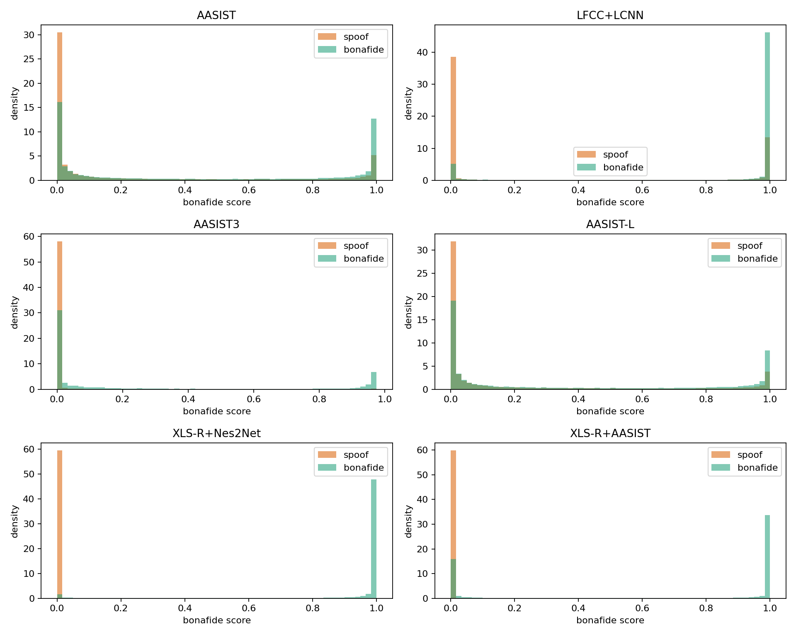
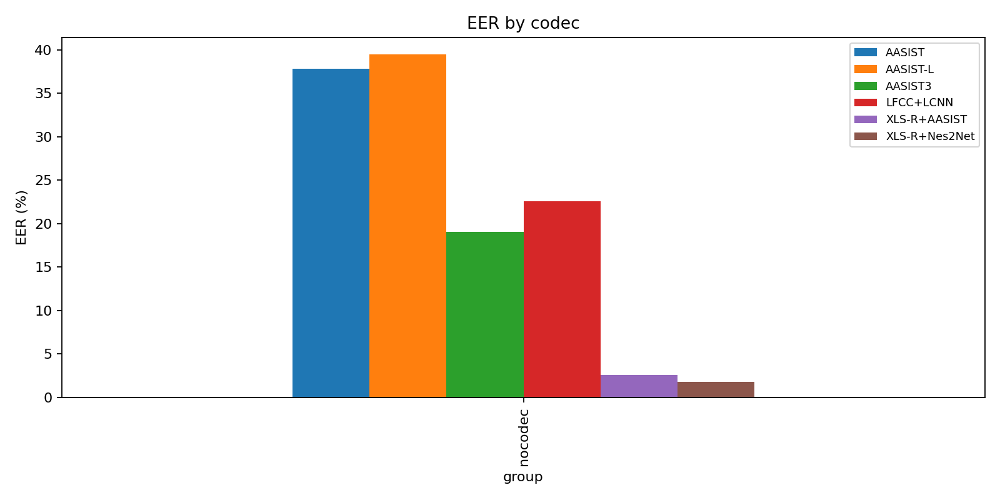
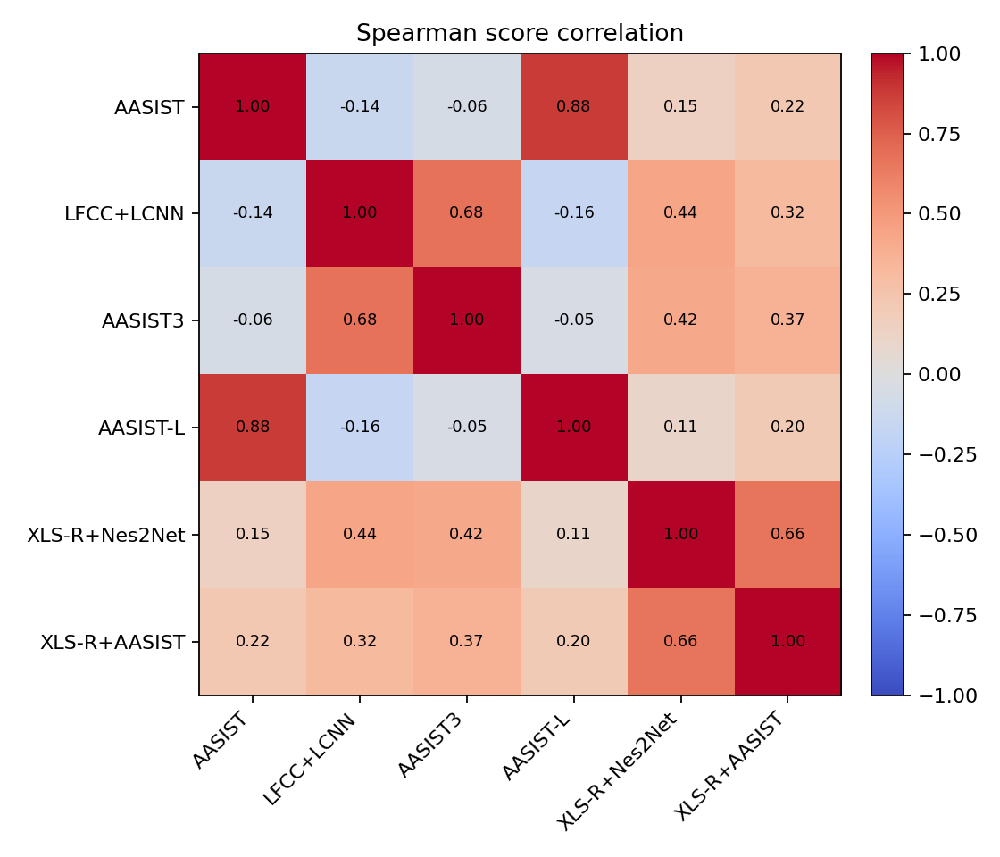

# Báo cáo Đồ án Thực tập 1
## Khảo sát và đánh giá các phương pháp phát hiện giọng nói giả mạo (Speech Deepfake Detection)

---

## Lời cam đoan

*[Phần này sẽ được tác giả tự điền sau.]*

---

## Lời ngỏ

*[Phần này sẽ được tác giả tự điền sau.]*

---

## Tóm tắt nội dung

*[Phần abstract — sẽ viết sau cùng khi 4 chương đã hoàn thiện. Dự kiến ~250 từ tóm tắt: bối cảnh, mục tiêu, phương pháp (survey + reproduce 6 models × 4 datasets), kết quả chính (bảng EER, phát hiện ban đầu từ error analysis ASV5), đóng góp và hướng tiếp theo.]*

---

## Chương 1: Giới thiệu

### 1.1 Bối cảnh và động lực

Trong khoảng một thập kỷ trở lại đây, các kỹ thuật tổng hợp giọng nói (Text-to-Speech, TTS) và chuyển đổi giọng nói (Voice Conversion, VC) đã có những bước tiến vượt bậc. Từ các mô hình tự hồi tiếp như WaveNet và Tacotron đến các kiến trúc end-to-end hiện đại như VITS, neural codec TTS, hay các mô hình dựa trên diffusion, chất lượng giọng nói tổng hợp ngày càng tiệm cận với giọng nói thật về cả độ tự nhiên lẫn độ giống người nói gốc. Nhiều hệ thống thương mại hiện nay có thể nhân bản (voice cloning) một giọng nói từ chỉ vài giây mẫu âm thanh, mở ra nhiều ứng dụng tích cực như trợ lý ảo, đọc sách nói, hay khôi phục giọng cho người mất khả năng nói.

Tuy nhiên, sự phát triển nhanh của các kỹ thuật này cũng kéo theo những rủi ro nghiêm trọng. Các vụ lừa đảo qua điện thoại bằng giọng nói giả mạo người thân, mạo danh lãnh đạo doanh nghiệp để lừa chuyển khoản (CEO fraud), hay phát tán thông tin sai lệch bằng cách giả giọng nhân vật công chúng đã được ghi nhận tại nhiều quốc gia trong những năm gần đây. Rủi ro này càng đáng quan ngại khi các công cụ voice cloning ngày càng dễ tiếp cận và chi phí thấp.

Trước thực trạng đó, bài toán phát hiện giọng nói giả mạo (Speech Deepfake Detection — SDD) trở thành một hướng nghiên cứu quan trọng. Ở dạng cơ bản nhất, bài toán được phát biểu như một tác vụ phân loại nhị phân: cho một đoạn audio đầu vào, hệ thống cần xác định đoạn đó là giọng thật (*bonafide*) hay đã được tổng hợp/chỉnh sửa (*spoof*). Đầu ra của hệ thống thường là một điểm số liên tục (score) phản ánh xác suất *bonafide*, từ đó có thể đưa ra quyết định phân loại bằng cách so sánh với một ngưỡng. Để đánh giá hệ thống, cộng đồng nghiên cứu thường sử dụng chỉ số Equal Error Rate (EER) — tỉ lệ lỗi tại điểm cân bằng giữa False Acceptance Rate và False Rejection Rate, càng thấp càng tốt.

### 1.2 Các thách thức chính

Mặc dù đã có nhiều tiến bộ, các hệ thống SDD hiện nay vẫn đối mặt với một số thách thức cốt lõi:

**Khả năng tổng quát hoá liên miền (cross-domain generalization).** Nhiều mô hình được báo cáo hiệu năng cao đạt EER rất thấp trên benchmark mà chúng được huấn luyện (ví dụ ASVspoof 2019 LA), nhưng EER tăng đáng kể khi được đánh giá trên dữ liệu có phân bố khác — chẳng hạn audio đã qua nén lossy (ASVspoof 2021 DF) hoặc được scraping từ mạng xã hội (In-the-Wild). Hiện tượng này cho thấy nhiều mô hình đang học các đặc trưng phụ thuộc vào điều kiện thu âm hoặc artifact cụ thể của tập huấn luyện, thay vì các dấu hiệu tổng quát của giọng nói giả mạo.

**Tốc độ phát triển của các kỹ thuật tấn công.** Các phương pháp TTS/VC mới liên tục xuất hiện, đặc biệt là các kiến trúc dựa trên neural codec, diffusion, và adversarial training. Nhiều dataset benchmark được xây dựng cách đây vài năm có thể không bao gồm các loại tấn công mới nhất, dẫn đến rủi ro trước các dạng tấn công mà mô hình chưa từng thấy. Việc đảm bảo các benchmark cập nhật kịp thời là một thách thức về mặt dữ liệu và quy trình đánh giá.

**Điều kiện thực tế.** Audio trong thực tế thường đi kèm các yếu tố như nén lossy (MP3, AAC, OPUS), nhiễu nền, mic chất lượng kém, hoặc qua nhiều lớp xử lý hậu kỳ. Các yếu tố này có thể che lấp hoặc làm biến dạng các dấu vết phổ (spectral artifact) mà nhiều mô hình dựa vào để phát hiện giọng nói giả mạo. Các mô hình huấn luyện trên audio sạch trong phòng lab thường suy giảm hiệu năng đáng kể khi áp dụng cho audio thực tế.

**Mất cân bằng và đa dạng của dữ liệu.** Trong nhiều dataset, số lượng mẫu *spoof* lớn hơn nhiều so với *bonafide* (ví dụ ASVspoof 2019 LA có khoảng 7,3 nghìn *bonafide* trên 64 nghìn *spoof*), đồng thời độ đa dạng của *bonafide* về người nói, ngôn ngữ, và điều kiện thu âm thường hạn chế hơn. Điều này có thể ảnh hưởng đến khả năng học các đặc trưng tổng quát của giọng nói thật, đặc biệt khi áp dụng sang các tập dữ liệu cross-domain.

### 1.3 Hướng tiếp cận và cấu trúc báo cáo

Báo cáo này được thực hiện như bước khởi đầu trong một quy trình nghiên cứu (gồm ba giai đoạn: Thực tập 1, Thực tập 2 và Luận văn tốt nghiệp) tập trung vào ba hoạt động chính: (i) khảo sát cơ sở lý thuyết về dữ liệu, kiến trúc và phương pháp đánh giá; (ii) tái lập (reproduce) một số mô hình tiêu biểu trên các tập dữ liệu phổ biến để có số liệu tham chiếu thực tế; và (iii) phân tích lỗi sơ bộ (preliminary error analysis) trên một dataset trọng tâm, từ đó đưa ra đề xuất hướng tiếp cận ở mức ý niệm. Các đề xuất chi tiết về thiết kế thí nghiệm và triển khai thực tế sẽ được phát triển ở Thực tập 2 và Luận văn.

Cụ thể, báo cáo tái lập sáu mô hình đại diện cho các nhóm tiếp cận khác nhau (LFCC+LCNN, AASIST, AASIST-L, AASIST3, XLS-R+AASIST, XLS-R+Nes2Net) trên bốn dataset phổ biến (ASVspoof 2019 LA, ASVspoof 2021 DF, ASVspoof 5, In-the-Wild). Toàn bộ thí nghiệm được thực hiện trên nền tảng Kaggle với GPU T4, chủ yếu sử dụng checkpoint công bố công khai; riêng LFCC+LCNN được huấn luyện lại như baseline do không có checkpoint phù hợp. Phân tích lỗi sơ bộ được tập trung vào ASVspoof 5 — tập dữ liệu mới nhất trong chuỗi ASVspoof Challenge với Track 1 eval gồm 16 attack và metadata codec phong phú — nhằm đưa ra cái nhìn cụ thể về điểm mạnh và điểm yếu của từng nhóm mô hình trong các kịch bản tấn công gần đây.

Phần còn lại của báo cáo được tổ chức như sau. **Chương 2** trình bày cơ sở lý thuyết, bao gồm phát biểu bài toán, các loại tấn công, các tập dữ liệu benchmark, các nhóm kiến trúc tiếp cận, và phương pháp đánh giá. **Chương 3** mô tả thiết lập thí nghiệm, trình bày kết quả EER tổng hợp trên sáu mô hình và bốn dataset, và phân tích lỗi sơ bộ trên ASVspoof 5. **Chương 4** tổng kết các phát hiện chính, đưa ra đề xuất hướng tiếp cận ở mức ý niệm và các bước phát triển tiếp theo trong khuôn khổ Thực tập 2 và Luận văn.

---

## Chương 2: Cơ sở lý thuyết

### 2.1 Bài toán và các loại tấn công

Speech Deepfake Detection (SDD) là bài toán xây dựng một hệ thống *countermeasure* (CM) để phân biệt audio thật (*bonafide*) và audio giả mạo (*spoof*). Ở mức utterance-level, với một đoạn tín hiệu âm thanh đầu vào $x$, mô hình sinh ra một điểm số $s = f(x) \in \mathbb{R}$ thể hiện mức độ tin cậy rằng $x$ là *bonafide*. Quyết định cuối cùng được đưa ra bằng cách so sánh score với một ngưỡng $\tau$: nếu $s \geq \tau$ thì phân loại là *bonafide*, ngược lại là *spoof*. Trong toàn bộ báo cáo này, nhãn được quy ước là *bonafide* = 1 và *spoof* = 0 để thống nhất với cách tính EER ở Chương 3.

Trong bối cảnh Automatic Speaker Verification (ASV), CM thường được đặt trước hoặc song song với hệ thống xác thực người nói. ASV trả lời câu hỏi "người nói có đúng là danh tính đã khai báo không?", còn CM trả lời câu hỏi "tín hiệu đầu vào có phải là giọng thật không?". Hai bài toán liên quan nhưng không đồng nhất: một audio giả có thể bắt chước đúng speaker target và qua được ASV, nhưng vẫn cần bị CM phát hiện là spoof. Vì vậy các challenge ASVspoof đánh giá CM như một thành phần bảo vệ ASV trước các tấn công tổng hợp, chuyển đổi giọng hoặc replay [1], [2].

Một CM system điển hình gồm ba bước. **Front-end** chuyển waveform thành representation: có thể là hand-crafted spectral features như LFCC/CQCC, feature học trực tiếp từ raw waveform, hoặc representation từ self-supervised learning (SSL) model như Wav2Vec2, XLS-R, WavLM. **Back-end** nhận representation này để mô hình hoá quan hệ thời gian, phổ hoặc speaker/utterance-level cue. **Classifier/scoring head** sinh score cuối cùng cho từng utterance. Cách tách `front-end` và `back-end` này giúp so sánh các nhóm kiến trúc ở §2.3: khác biệt chính giữa LFCC+LCNN, AASIST và XLS-R+Nes2Net không chỉ nằm ở classifier, mà nằm ở loại representation mà mô hình được phép khai thác.

Về threat model, các tấn công trong SDD thường được chia thành bốn nhóm chính:

- **Logical Access (LA).** Attacker tiêm audio giả trực tiếp vào pipeline số, không cần phát lại qua loa/micro. Hai dạng phổ biến là **Text-to-Speech (TTS)** và **Voice Conversion (VC)**. TTS sinh giọng nói từ văn bản; VC giữ nội dung hoặc đặc tính ngữ âm của nguồn nhưng biến đổi speaker identity sang giọng đích. LA là kịch bản chính của ASVspoof 2019 LA, ASVspoof 2021 DF và ASVspoof 5 Track 1.
- **Physical Access (PA) / replay.** Attacker phát lại audio qua thiết bị vật lý rồi thu hoặc đưa vào hệ thống qua microphone. Khác với LA, replay chứa thêm dấu vết của loa, phòng, microphone và khoảng cách thu. Do đó một detector huấn luyện cho LA không nhất thiết generalize sang PA, và ngược lại.
- **Deepfake/in-the-wild setting.** Audio được thu thập từ social media, video streaming hoặc nguồn công khai, thường đã qua codec, noise, trimming, post-processing và có metadata không đầy đủ. Đây không phải một attack mechanism đơn lẻ, mà là một deployment-like condition dùng để kiểm tra cross-domain generalization.
- **Adversarial và neural codec attacks.** Adversarial attacks thêm perturbation có chủ đích để làm sai lệch detector. Neural codec attacks liên quan đến các TTS/VC pipeline hiện đại sử dụng codec representation như EnCodec/SNAC/Vocos, khiến artifact không còn giống các spectral artifact truyền thống trong benchmark cũ. ASVspoof 5 đưa các yếu tố này vào benchmark ở quy mô lớn hơn các phiên bản trước [3].

Báo cáo này tập trung thực nghiệm vào nhóm LA và deepfake/in-the-wild vì bốn dataset reproduce ở Chương 3 chủ yếu thuộc hai nhóm này. PA/replay và adversarial robustness được trình bày ở mức cơ sở lý thuyết để làm rõ bức tranh nghiên cứu, nhưng chưa phải trọng tâm thực nghiệm của Thực tập 1.

### 2.2 Các tập dữ liệu benchmark

Dataset trong SDD không chỉ khác nhau về số lượng sample, mà còn khác nhau về giả định đánh giá. Có thể phân loại theo bốn trục chính: **attack scenario** (Logical Access, Physical Access/replay, partial manipulation), **recording/deployment condition** (clean lab, codec-compressed, in-the-wild, replay-aware), **attack generation family** (vocoder-era TTS/VC, neural codec/CoSG, diffusion/zero-shot TTS, adversarial) và **language coverage** (English-centric, Mandarin-heavy, multi-lingual). Bốn dataset được reproduce trong báo cáo không nhằm bao trùm toàn bộ landscape, mà đại diện cho bốn stress test chính trong scope Thực tập 1: clean benchmark, codec robustness, modern ASVspoof attacks và in-the-wild domain shift.

Bảng 2.1 tổng hợp các dataset chính. Cột "Kích thước" ưu tiên ghi split hoặc subset được dùng trong báo cáo nếu dataset được reproduce; với dataset chỉ tham chiếu, giá trị được ghi theo paper gốc ở mức tổng quan. Các dataset không reproduce được giữ trong bảng khi chúng đại diện cho một threat model quan trọng nhưng lệch scope hoặc chưa cần thiết cho pipeline thí nghiệm hiện tại.

**Bảng 2.1.** Tổng hợp một số dataset SDD tiêu biểu.

| Dataset | Năm | Kịch bản | Ngôn ngữ | Kích thước dùng/tham chiếu | Đặc điểm chính | Vai trò/lý do trong báo cáo |
|---------|-----|----------|----------|----------------------------|----------------|-------------------------|
| ASVspoof 2019 LA | 2019 | LA, TTS/VC | Anh | 71,237 utterances trong eval split dùng ở project | Clean lab, 19 attacks, metadata attack rõ | Reproduce: benchmark baseline trong điều kiện sạch |
| ASVspoof 2021 DF | 2021 | Deepfake/LA + codec | Anh | 458,868 utterances trong eval subset dùng ở project | Audio kế thừa ASV2019, re-encode qua nhiều codec/bitrate | Reproduce: stress test cho codec robustness |
| ASVspoof 5 Track 1 | 2024/2025 | LA/deepfake + adversarial context | Anh (MLS English partition) | 680,774 utterances trong eval split dùng ở project | Crowdsourced speech; toàn database có 32 attack algorithms, Track 1 eval có 16 attacks; có metadata codec/encoding | Reproduce: trọng tâm error analysis sơ bộ trên modern benchmark [16], [17] |
| In-the-Wild | 2022 | In-the-wild deepfake | Chủ yếu Anh | 31,779 utterances, 58 speakers trong bản dùng ở project | Scraped từ nguồn công khai, 20.8h bonafide và 17.2h spoofed audio | Reproduce: probe cho cross-domain generalization [4] |
| MLAAD v9 | 2024/2026 | Multi-lingual TTS | 51 ngôn ngữ | 678.3h synthetic voice theo arXiv v9 | 140 TTS models, 78 architectures | Không reproduce: phù hợp cross-lingual extension, nhưng chưa phải câu hỏi chính của Thực tập 1 [8] |
| SpeechFake | 2025 | Multi-lingual TTS/VC/neural vocoder | 46 ngôn ngữ | >3M deepfake samples, >3,000h audio | 40 speech synthesis tools, gồm TTS, voice conversion và neural vocoder | Không reproduce: benchmark quy mô lớn cho scale/language/method diversity; ứng viên mở rộng sau ASVspoof/In-the-Wild [29] |
| CodecFake / CodecFake+ | 2024/2025 | Codec-based speech generation | Nhiều nguồn | CodecFake+ dùng 31 codec models cho train và 17 CoSG models cho eval | Nhắm trực tiếp vào neural codec / CoSG attacks | Không reproduce: rất phù hợp để follow-up neural codec robustness, nhưng mới và lớn; ASVspoof 5 đang là benchmark hiện đại chính [21], [22] |
| EchoFake | 2025 | Zero-shot TTS + physical replay | Anh | >120h audio, >13K speakers | Replay-aware practical SDD với device/environment đa dạng | Không reproduce: quan trọng cho deployment/replay, nhưng lệch LA/DF scope hiện tại [23] |
| ADD 2022/2023 | 2022/2023 | Low-quality, partial fake, fake game, localization, algorithm recognition | Mandarin-heavy | Nhiều track challenge | Mở rộng ngoài binary utterance-level detection | Không reproduce: task/protocol khác với pipeline EER utterance-level [18], [19] |
| PartialSpoof | 2021/2022 | Partially spoofed utterances | Anh | Dựa trên ASVspoof 2019 LA | Có utterance-level và segment-level labels | Không reproduce: cần localization/segment-level setup, không khớp thí nghiệm hiện tại [20] |
| WaveFake | 2021 | TTS/vocoder | Anh + Nhật | Khoảng 104K utterances theo paper | Tập trung GAN/neural vocoder artifacts | Tham chiếu lịch sử cho vocoder artifacts; không đủ hiện đại làm main benchmark |
| FoR | 2019 | TTS | Anh | Khoảng 198K utterances theo paper | Dataset real/fake speech đời đầu, nhiều TTS cũ | Tham chiếu lịch sử, không dùng làm benchmark chính |

**ASVspoof 2019 LA** là điểm xuất phát hợp lý vì điều kiện sạch, protocol rõ và được dùng rộng rãi trong cộng đồng ASV anti-spoofing [1]. Trong project, phần được dùng để đánh giá là eval split gồm 71,237 utterance, trong đó có 7,355 bonafide và 63,882 spoof. Đây là split có quy mô lớn nhất của ASVspoof 2019 LA, không phải tổng train+dev+eval. Điểm mạnh của nó là metadata attack type đầy đủ, cho phép phân tích từng nhóm TTS/VC. Hạn chế là nhiều attack phản ánh công nghệ synthesis trước 2019 và không có codec/post-processing phức tạp. Vì vậy EER thấp trên ASVspoof 2019 LA không đủ để kết luận mô hình sẽ hoạt động tốt ngoài môi trường benchmark.

**ASVspoof 2021 DF** được thiết kế để đưa yếu tố codec và transmission condition vào đánh giá [2]. Về bản chất, dataset này dùng lại nguồn audio của ASVspoof 2019 nhưng xử lý qua nhiều codec/bitrate, vì vậy nó phù hợp để kiểm tra xem detector có còn phân biệt được bonafide/spoof khi spectral artifacts bị nén hoặc làm mờ hay không. Trong project, subset eval được xử lý thực tế gồm 458,868 utterance, với 16,977 bonafide và 441,891 spoof; con số này được dùng nhất quán trong Chương 3 thay vì trộn với kích thước official/full release. ASVspoof 2021 DF vì vậy đóng vai trò stress test trực tiếp cho `codec robustness`.

**ASVspoof 5** mở rộng benchmark sang crowdsourced speech, nhiều speaker/recording condition hơn và các attack gần với thế hệ TTS/VC hiện đại hơn [3], [16]. Dataset trong setup này lấy từ MLS English partition, nên không nên mô tả phần reproduce là multi-lingual dù MLS bản đầy đủ là Multilingual LibriSpeech. Cần phân biệt hai mức thống kê: toàn database ASVspoof 5 có 32 attack algorithms, còn Track 1 eval split được dùng trong project có 16 attacks. Trong phạm vi Thực tập 1, báo cáo dùng Track 1 eval cho stand-alone countermeasure/deepfake detection, gồm 680,774 utterance với 138,688 bonafide và 542,086 spoof. Track 2 SASV có trial structure và metric khác nên không nằm trong pipeline hiện tại. ASVspoof 5 là trọng tâm error analysis vì có metadata attack/codec/encoding, nhưng kết luận vẫn là preliminary diagnosis trên sáu checkpoint hiện có, chưa đại diện cho toàn bộ ASVspoof 5 challenge.

**In-the-Wild** khác với chuỗi ASVspoof ở chỗ nó không cố kiểm soát attack generator. Dataset được thu thập từ nguồn công khai cho 58 public figures, gồm 31,779 utterance: 19,963 bonafide và 11,816 spoof, tương ứng khoảng 20.8 giờ bonafide và 17.2 giờ spoofed audio [4]. Điểm mạnh của nó là phản ánh real-world condition: codec không đồng nhất, chất lượng nguồn khác nhau, speaker distribution khác training data và metadata attack không đầy đủ. Điểm yếu cũng nằm ở chính điều này: khó phân tích lỗi theo attack type và có khả năng tồn tại label noise. Trong báo cáo, In-the-Wild được dùng như probe cho `domain shift`, không dùng để rút ra kết luận chi tiết về từng attack mechanism.

Các dataset ngoài nhóm reproduce giúp làm rõ phần landscape còn lại. MLAAD v9 đáng chú ý cho cross-lingual evaluation vì mở rộng lên 51 ngôn ngữ và 140 TTS models [8]. SpeechFake đi theo hướng scale lớn hơn: hơn 3 triệu deepfake samples, hơn 3,000 giờ audio, 46 ngôn ngữ và 40 công cụ synthesis, bao gồm TTS, voice conversion và neural vocoder [29]. CodecFake/CodecFake+ nhắm trực tiếp vào codec-based speech generation, một hướng tấn công mới mà nhiều detector train trên vocoder-era datasets có thể bỏ sót [21], [22]. EchoFake đưa yếu tố physical replay vào speech deepfake thực tế [23]. ADD và PartialSpoof mở rộng bài toán sang low-quality/partial/localized manipulation [18], [19], [20]. Những dataset này chưa được đưa vào reproduce vì hoặc lệch task, hoặc đòi hỏi protocol/metric khác, hoặc vượt tài nguyên của Thực tập 1; tuy nhiên chúng nên được giữ trong literature review và future work để tránh hiểu nhầm rằng bốn dataset reproduce là đầy đủ cho mọi kịch bản SDD.

### 2.3 Các nhóm kiến trúc

Các kiến trúc SDD có thể được nhìn theo câu hỏi: mô hình lấy thông tin gì từ audio, representation đó đến từ đâu, và hệ thống có cơ chế nào để giữ ổn định khi attack/domain thay đổi hay không. Ở tầng cao nhất, có thể gom thành bốn nhóm lớn:

**Signal/task-specific supervised detectors.** Nhóm này dùng representation được thiết kế hoặc chuẩn hoá theo signal processing, rồi huấn luyện classifier/back-end supervised trên dữ liệu anti-spoofing. Nhánh cổ điển gồm LFCC, CQCC, MFCC hoặc IMFCC với GMM/SVM/LCNN. Nhánh học sâu hơn dùng spectrogram, CQT hoặc LFCC làm input cho LCNN, ResNet, TDNN, Transformer/Conformer. Ưu điểm là nhẹ, dễ triển khai và có baseline lâu đời trong ASVspoof. Điểm yếu là representation thường nhạy với artifact của training dataset: khi audio bị codec, replay channel hoặc neural codec generation làm thay đổi spectral/phase cues, khả năng generalize có thể giảm. LFCC+LCNN trong báo cáo đại diện cho nhóm này.

**Raw waveform / end-to-end detectors.** RawNet2 và AASIST bỏ qua feature engineering thủ công, học trực tiếp từ waveform [5], [6]. RawNet2 dùng SincConv/residual blocks để học filter và temporal pattern. AASIST bổ sung heterogeneous graph attention để mô hình hoá quan hệ giữa spectral branch và temporal branch; ý tưởng chính là artifact của spoofed speech có thể xuất hiện trong quan hệ spectro-temporal dài hơn, không chỉ ở một frame hoặc một vùng tần số riêng lẻ. AASIST/AASIST-L là mốc quan trọng vì đạt kết quả tốt trên ASVspoof 2019 LA với số tham số nhỏ [6]. Tuy nhiên, vì không có large-scale speech pre-training, nhóm này vẫn có nguy cơ học artifact gắn với training distribution.

**SSL/foundation front-end + anti-spoofing back-end.** Nhóm này dùng Wav2Vec2, XLS-R, WavLM, HuBERT hoặc speech encoder lớn làm front-end, sau đó gắn back-end như AASIST, MFA, Nes2Net, pooling/MLP, state-space model hoặc layer-selection module [7], [9], [10]. Lợi thế kỳ vọng là SSL representation chứa prior về phonetic structure, speaker/channel variation và acoustic regularity từ pre-training quy mô lớn, nên có nền tảng ổn định hơn khi attack hoặc codec thay đổi. Các paper tiêu biểu gồm Wav2Vec2/XLS-R + AASIST của Tak et al. [12], WavLM + Multi-Fusion Attentive classifier của Guo et al. [24], AASIST3 [11], WavLM back-ends/fusion trong ASVspoof 5 [25], [26], Nes2Net [13], và XLSR-Mamba [30]. Hạn chế chính là chi phí: riêng XLS-R 300M hoặc WavLM Large đã lớn hơn nhiều so với AASIST/LFCC+LCNN, và hiệu năng phụ thuộc checkpoint, layer selection, fine-tuning, augmentation và calibration.

**System-level robustness strategies.** Các hệ thống mạnh gần đây thường không chỉ thay backbone mà còn dùng codec/noise/reverb augmentation, CodecFake-aware training, score calibration và score-level/feature-level fusion. ASVspoof 5 evaluation 2026 cho thấy nhiều hệ thống vẫn suy giảm dưới adversarial attacks và neural encoding/compression [17], nên robustness cần được xem như một tầng thiết kế hệ thống. Whisper-based detector hoặc Whisper+AASIST là hướng emerging cho foundation-model front-end [27], nhưng trong literature hiện tại Wav2Vec2/XLS-R/WavLM vẫn là các encoder được dùng rộng rãi hơn trong anti-spoofing benchmark.

Hai hướng back-end hiện đại đáng nhắc nhưng chưa reproduce là **XLSR-Mamba** và **Nes2Net-LA**. XLSR-Mamba kết hợp XLS-R/wav2vec 2.0 feature với Dual-Column Bidirectional Mamba, nhằm thay self-attention đắt đỏ bằng selective state-space model có khả năng xử lý chuỗi dài và inference nhanh hơn trên ASVspoof 2021 LA/DF và In-the-Wild [30]. Nes2Net-LA là biến thể mới của Nes2Net bổ sung local attention để tăng local context modeling và fine-grained spoofing feature extraction; paper này đi kèm MultiAPI Spoof, một dataset khoảng 230 giờ synthetic speech từ 30 API, và hiện nên được đọc như preprint/submission Interspeech 2026 thay vì benchmark đã ổn định [31]. Hai model này phù hợp để đưa vào literature review vì chúng cho thấy hướng phát triển sau Nes2Net-X: không chỉ dùng SSL front-end mạnh, mà còn tối ưu back-end để khai thác temporal/local artifact hiệu quả hơn.

**Bảng 2.2.** Một số nguồn đại diện cần nhắc trong literature review.

| Nhóm | Paper/dataset đại diện | Vai trò trong review | Trạng thái trong report |
|------|------------------------|----------------------|-------------------------|
| Modern benchmark | ASVspoof 5 design/evaluation [16], [17] | Crowdsourced speech, adversarial setting, neural encoding/compression | Reproduce Track 1 eval; Track 2 ngoài scope |
| Codec-based attacks | CodecFake, CodecFake+ [21], [22] | Chỉ ra gap với CoSG/neural codec speech | Chưa reproduce; đưa vào future work |
| Practical replay | EchoFake [23] | Zero-shot TTS + physical replay dưới device/environment đa dạng | Chưa reproduce; lệch LA/DF scope |
| Partial/localized fake | ADD 2022/2023, PartialSpoof [18], [19], [20] | Mở rộng sang low-quality, partial fake, localization | Chưa reproduce; cần task/metric khác |
| Large-scale multilingual data | SpeechFake [29] | Scale lớn, 46 ngôn ngữ, nhiều generation method gồm TTS/VC/neural vocoder | Chưa reproduce; ứng viên mở rộng cross-lingual và modern-method robustness |
| SSL back-end design | WavLM+MFA, WavLM back-ends/ensemble, XLSR-Mamba [24], [25], [26], [30] | Đại diện cho hướng SSL + fusion/state-space gần đây | Chưa reproduce; nên cân nhắc sau XLS-R baseline |
| Nes2Net follow-up/preprint | Nes2Net-LA / MultiAPI Spoof [31] | Local-attention extension của Nes2Net và dataset multi-API | Chưa reproduce; mới, cần đọc thận trọng khi claim SOTA |
| Reproduced SSL systems | AASIST3, XLS-R+AASIST, Nes2Net [11], [12], [13] | Liên hệ trực tiếp với sáu mô hình Chương 3 | Đã đưa vào bảng EER |
| Compact former-SOTA | AASIST/AASIST-L [6] | Mốc quan trọng của raw waveform + graph attention trên ASVspoof 2019 LA | Reproduce để so với SSL front-end |

Trong sáu mô hình reproduce, hai mốc cần được đọc kỹ hơn là **AASIST/AASIST-L** và **XLS-R + Nes2Net-X**. AASIST là former-SOTA compact single system trên ASVspoof 2019 LA: paper gốc báo cáo 0.83% EER và 0.0275 min t-DCF với khoảng 297K tham số; AASIST-L đạt 0.99% EER và 0.0309 min t-DCF với khoảng 85K tham số [6]. Điểm quan trọng không chỉ là EER thấp, mà là mô hình đạt kết quả mạnh bằng raw waveform encoder và heterogeneous spectro-temporal graph attention, không cần SSL front-end lớn hoặc ensemble. Vì vậy AASIST/AASIST-L là baseline hiện đại hơn LFCC+LCNN nhưng vẫn đủ gọn để so sánh với nhóm SSL 300M.

XLS-R + Nes2Net-X đại diện cho hướng hiện đại hơn: dùng foundation speech front-end rất lớn để sinh representation, sau đó dùng một back-end anti-spoofing gọn để khai thác đặc trưng đó [9], [13]. Nes2Net-X không làm toàn hệ thống trở nên nhẹ, vì XLS-R 300M vẫn chiếm phần lớn tham số và FLOPs; "lightweight" chủ yếu nói về back-end. Tuy nhiên, thiết kế nested/multi-scale của Nes2Net-X cho phép xử lý SSL features trực tiếp và báo cáo kết quả mạnh trên ASVspoof 2021 DF cũng như In-the-Wild [13]. Do đã có nhiều peer system cùng thời dùng WavLM, fusion, XLSR-Mamba hoặc các back-end SSL khác, và đã có preprint mở rộng Nes2Net theo hướng local attention, báo cáo này không gọi Nes2Net-X là SOTA tuyệt đối hiện tại; cách diễn đạt chính xác hơn là một đại diện của lớp SSL/foundation front-end + lightweight anti-spoofing back-end đang rất mạnh trong giai đoạn 2024-2025 [30], [31].

Bảng 2.3 tổng hợp sáu mô hình được reproduce trong Chương 3. Các giá trị hiệu năng trong cột "Kết quả paper" chỉ để đặt mô hình vào bối cảnh, không dùng thay cho kết quả reproduce. Các metric khác loại như EER, min t-DCF và minDCF không được so sánh trực tiếp với nhau.

**Bảng 2.3.** So sánh sáu mô hình được tái lập.

| Mô hình | Input/front-end | Back-end | Quy mô/compute | Vai trò trong reproduce | Failure mode cần chú ý | Kết quả paper/context |
|---------|-----------------|----------|---------------|-------------------------|------------------------|----------------------|
| LFCC + LCNN | LFCC spectral features | LCNN/MFM | Nhỏ; rẻ nhất trong 6 model | Baseline signal-processing truyền thống | Nhạy với codec, channel mismatch và unseen artifacts | LFCC/LCNN variants thường là baseline trong ASVspoof; không cite như SOTA nếu không đúng recipe |
| AASIST | Raw waveform | Integrated spectro-temporal graph attention | ~297K params; thấp-trung bình | Former-SOTA compact single model; cầu nối giữa baseline truyền thống và SSL | Không có large-scale speech pretraining; có thể suy giảm khi domain/codec/attack thay đổi | ASVspoof 2019 LA: 0.83% EER, 0.0275 min t-DCF [6] |
| AASIST-L | Raw waveform | Lightweight AASIST | ~85K params; thấp | Kiểm tra trade-off compactness/performance | Capacity thấp hơn AASIST, cùng họ lỗi với AASIST | ASVspoof 2019 LA: 0.99% EER, 0.0309 min t-DCF [6] |
| AASIST3 | Wav2Vec2 SSL features | KAN bridge + modified AASIST | Hàng trăm triệu params nếu tính SSL | Đại diện checkpoint ASVspoof 2024-context dùng SSL + KAN | Metric paper là minDCF trong challenge condition; không nên gọi SOTA rộng | ASVspoof 2024: minDCF 0.5357 closed, 0.1414 open [11] |
| XLS-R + AASIST | XLS-R 300M | AASIST | ~300M+ params; cao | Mốc SSL-AASIST sớm chứng minh lợi ích wav2vec2/XLS-R front-end | Tốn VRAM; phụ thuộc checkpoint, augmentation và calibration | ASVspoof 2021 LA/DF đạt kết quả mạnh trong setup có augmentation [12] |
| XLS-R + Nes2Net-X | XLS-R 300M | Nes2Net-X nested back-end | ~300M total; back-end khoảng 0.5M | Đại diện lớp SSL/foundation front-end + lightweight back-end 2025 | Front-end vẫn là bottleneck; ASV5/codec khó vẫn gây EER cao trong project | Báo cáo kết quả mạnh trên ASVspoof 2021 và In-the-Wild [13] |

### 2.4 Phương pháp đánh giá

Trong speech anti-spoofing, hệ thống thường sinh một score liên tục cho từng utterance thay vì chỉ xuất nhãn nhị phân. Vì vậy các metric quan trọng nhất không chỉ đo accuracy tại một ngưỡng cố định, mà còn đo toàn bộ trade-off giữa việc chấp nhận nhầm audio giả và từ chối nhầm audio thật. Báo cáo này dùng **Equal Error Rate (EER)** làm metric chính vì đây là chỉ số phổ biến nhất trong các paper và benchmark ASVspoof/In-the-Wild, đồng thời cũng là metric trực tiếp được tính trong phần reproduce ở Chương 3.

Với một ngưỡng $\tau$, mô hình phân loại các utterance có score $s \geq \tau$ là *bonafide* và $s < \tau$ là *spoof*. Khi đó:

$$
\mathrm{FAR}(\tau) = \frac{\mathrm{FP}(\tau)}{\mathrm{FP}(\tau) + \mathrm{TN}(\tau)}
$$

$$
\mathrm{FRR}(\tau) = \frac{\mathrm{FN}(\tau)}{\mathrm{FN}(\tau) + \mathrm{TP}(\tau)}
$$

Ở đây FAR (False Acceptance Rate) là tỉ lệ spoof bị chấp nhận nhầm như bonafide, còn FRR (False Rejection Rate) là tỉ lệ bonafide bị từ chối nhầm như spoof. EER là giá trị tại ngưỡng $\tau^*$ sao cho $\mathrm{FAR}(\tau^*) \approx \mathrm{FRR}(\tau^*)$. Trong thực tế, $\tau^*$ được tìm bằng cách sweep qua các score hoặc nội suy trên ROC/DET curve.

Ưu điểm của EER là không phụ thuộc vào một operating threshold cố định, nên phù hợp để so sánh các mô hình có thang score khác nhau. Đây là lý do EER được dùng làm metric chính trong Chương 3, nơi mục tiêu là reproduce và so sánh tương đối giữa sáu mô hình trên bốn dataset bằng CM score và ground-truth label. Tuy nhiên EER cũng có hạn chế: nó giả định hai loại lỗi có chi phí cân bằng, trong khi deployment thực tế có thể xem spoof false acceptance nguy hiểm hơn bonafide false rejection. EER cũng không phản ánh calibration của score; một mô hình có EER thấp vẫn có thể tạo score không tương ứng với xác suất thật, gây khó khi chọn threshold cố định.

**Detection Cost Function (DCF) và minDCF** là nhóm metric dùng cost model để phản ánh prior và chi phí lỗi tại các operating point cụ thể. Thay vì chỉ tìm điểm FAR = FRR, DCF gán trọng số cho miss/false alarm theo kịch bản ứng dụng. Trong ASVspoof 5 Track 1, minimum DCF được dùng như metric chính cho stand-alone spoof/deepfake countermeasure, bên cạnh các phân tích calibration như actual DCF và log-likelihood-ratio cost [17]. Nhóm metric này gần deployment hơn EER khi hệ thống cần hoạt động ở một prior spoof rất thấp hoặc khi false acceptance có chi phí cao hơn false rejection.

Các challenge ASVspoof trước đó còn dùng **minimum tandem Detection Cost Function (min t-DCF)** để đánh giá CM khi đặt trong hệ thống ASV hoàn chỉnh [14]. Metric này tính đến prior và cost của nhiều loại lỗi trong pipeline ASV+CM, nên phù hợp với kịch bản speaker verification. Min t-DCF cần thông tin về ASV system, ASV score và cost model; vì dữ liệu reproduce hiện có chủ yếu gồm CM scores và labels, báo cáo chưa tính min t-DCF cho Chương 3.

Với bài toán **spoofing-aware speaker verification (SASV)**, nơi hệ thống phải xử lý đồng thời target, non-target và spoofed target trials, metric thường dùng là các biến thể DCF dành riêng cho SASV, chẳng hạn architecture-agnostic DCF (a-DCF) trong ASVspoof 5 Track 2 [17]. Metric này không áp dụng trực tiếp cho phần reproduce hiện tại vì báo cáo chỉ đánh giá CM ở utterance-level, không có ASV enrollment/trial structure.

**ROC curve** và **DET curve** là công cụ trực quan để xem trade-off giữa các loại lỗi ở nhiều threshold. ROC biểu diễn True Positive Rate theo False Positive Rate; DET biểu diễn FAR theo FRR trên thang xác suất Gaussian, thường được cộng đồng speaker verification và anti-spoofing dùng vì dễ quan sát vùng lỗi thấp. Từ ROC có thể tính **AUC**, nhưng trong anti-spoofing AUC thường đóng vai trò phụ trợ hơn EER/minDCF vì AUC trung bình hoá hiệu năng trên toàn bộ dải threshold, bao gồm cả những vùng không thực tế trong deployment.

Các metric phân loại như **accuracy, precision, recall và F1-score** vẫn xuất hiện trong một số paper audio deepfake detection và các challenge ngoài ASVspoof, đặc biệt khi bài toán được đóng khung như binary classification thông thường. Tuy nhiên, accuracy dễ gây hiểu nhầm khi dữ liệu lệch lớp, ví dụ các tập ASVspoof thường có số spoof lớn hơn bonafide. Precision/recall/F1 hữu ích khi đã chọn threshold hoặc khi cần nhấn mạnh false positive/false negative, nhưng chúng không thay thế được EER/minDCF trong so sánh countermeasure chuẩn.

**Calibration metrics** đánh giá score có thể được dùng như xác suất hoặc log-likelihood ratio đáng tin cậy hay không. Các chỉ số như log loss / negative log-likelihood, Brier score, Expected Calibration Error (ECE), actual DCF và $C_{\mathrm{llr}}$ đặc biệt quan trọng khi hệ thống cần threshold cố định, score fusion hoặc deployment có cost/prior đã biết. Trong error analysis ASVspoof 5, báo cáo đã lưu ECE trong `metrics.csv`; tuy nhiên phần reproduce chính vẫn ưu tiên EER, còn calibration được xem là hướng phân tích bổ sung.

Cuối cùng, các task mở rộng như **partial spoof detection** hoặc **manipulation localization** cần metric khác với utterance-level EER. ADD 2022/2023 và PartialSpoof-style tasks có thể dùng segment-level F1, sentence-level accuracy, weighted EER hoặc macro-F1 tuỳ track [18], [19], [20]. Các metric này phản ánh câu hỏi "đoạn nào bị chỉnh sửa?" hoặc "thuật toán sinh nào tạo ra audio?", trong khi pipeline của báo cáo hiện chỉ trả lời câu hỏi utterance-level "bonafide hay spoof?". Vì vậy chúng được nhắc như bối cảnh literature và future work, chưa được dùng trong Chương 3.

### 2.5 Các thách thức hiện tại

Từ các survey gần đây và từ thiết kế của các benchmark ASVspoof/In-the-Wild, có thể rút ra bốn thách thức chính làm nền cho phần thực nghiệm ở Chương 3 [3], [4], [15].

**Cross-domain generalization.** Dataset evidence rõ nhất là khoảng cách giữa clean benchmark và in-the-wild benchmark. ASVspoof 2019 LA có điều kiện kiểm soát, attack metadata rõ và ít yếu tố channel phức tạp. In-the-Wild lại chứa audio từ nguồn công khai, speaker distribution khác, codec khác và attack metadata thiếu. Nếu mô hình học artifact phụ thuộc dataset thay vì cue tổng quát của spoofed speech, EER sẽ tăng mạnh khi chuyển domain. Về mặt kiến trúc, hand-crafted features và small end-to-end models dễ bị ảnh hưởng hơn vì representation được học trong phạm vi dữ liệu anti-spoofing hẹp. SSL front-end được kỳ vọng giảm một phần gap này nhờ pre-training trên audio đa dạng, nhưng cần kết quả cross-dataset ở Chương 3 để kiểm chứng trong project cụ thể.

**Codec robustness.** ASVspoof 2021 DF được thiết kế trực tiếp cho vấn đề này: audio từ nguồn ASVspoof 2019 được xử lý qua nhiều codec/bitrate [2]. Codec lossy có thể xoá high-frequency components, làm mờ phase/spectral artifacts hoặc tạo artifact mới không liên quan đến synthesis. Điều này ảnh hưởng đặc biệt tới các mô hình dựa vào spectral cues cục bộ như LFCC+LCNN, và cũng có thể ảnh hưởng tới raw waveform models nếu chúng học artifact ở waveform distribution gốc. Nếu SSL representation học được cấu trúc speech ổn định hơn, các mô hình XLS-R-based trong Chương 3 nên có generalization gap nhỏ hơn trên ASVspoof 2021 DF.

**Modern attacks và adversarial setting.** Các hệ TTS/VC hiện đại dùng neural codec, diffusion hoặc pipeline nhiều tầng có artifact khác với các hệ cũ trong ASVspoof 2019. ASVspoof 5 đưa thêm các attack gần thời điểm hiện tại hơn và có adversarial track riêng [3], [16], [17]. CodecFake/CodecFake+ cũng cho thấy deepfake từ codec-based speech generation có thể tạo ra failure mode khác với vocoder-era datasets [21], [22]. Thách thức ở đây không chỉ là "thêm nhiều attack", mà là thay đổi bản chất của cue: detector có thể không còn tìm thấy dấu hiệu vocoder/spectral quen thuộc. Vì vậy thứ hạng mô hình trên ASVspoof 2019 LA không nhất thiết dự đoán thứ hạng trên ASVspoof 5 hoặc CodecFake-style data. Đây là lý do §3.4 chọn ASVspoof 5 làm trọng tâm error analysis, còn CodecFake được giữ như hướng future work.

**Multi-linguality, fairness và deployment constraints.** Phần lớn benchmark kinh điển tập trung tiếng Anh hoặc một số corpus giới hạn. MLAAD v9 mở rộng câu hỏi sang 51 ngôn ngữ, cho thấy SDD không nên chỉ được đánh giá trên English-centric data [8]. EchoFake lại nhấn mạnh ràng buộc deployment khác: audio synthetic có thể đi qua replay channel và thiết bị tiêu dùng trước khi đến detector [23]. Ngoài ra, deployment thực tế còn bị ràng buộc bởi latency, VRAM, privacy và khả năng chạy trên edge device. AASIST/AASIST-L có lợi thế compute, nhưng có thể kém ổn định khi domain thay đổi; XLS-R/Nes2Net có lợi thế representation nhưng chi phí cao. Trade-off này không được giải quyết chỉ bằng một bảng EER, mà cần phân tích đồng thời accuracy, robustness và resource cost trong các bước tiếp theo.

Các thách thức trên tạo khung diễn giải cho Chương 3: ASVspoof 2019 LA kiểm tra clean benchmark performance, ASVspoof 2021 DF kiểm tra codec robustness, ASVspoof 5 kiểm tra modern attack robustness ở mức sơ bộ, và In-the-Wild kiểm tra cross-domain generalization.

---

## Chương 3: Reproduce và phân tích kết quả

Chương này tái lập sáu mô hình anti-spoofing trên bốn dataset đã giới thiệu ở Chương 2, sau đó tiến hành phân tích lỗi trên ASVspoof 5 và phân tích cross-dataset để rút ra các phát hiện. Báo cáo phân biệt rõ hai thành phần: (i) các checkpoint *pretrained* được lấy từ literature và (ii) phần *do project thực hiện* — bao gồm pipeline đánh giá thống nhất, cấu hình eval, error analysis và phân tích so sánh.

**Đóng góp của chương.** Trong phạm vi báo cáo, ba đóng góp chính được tập trung vào:

1. **Pipeline đánh giá thống nhất.** Các notebook eval của bốn dataset được sinh tự động từ một template chung, dùng cùng định dạng kết quả (xem §3.1) để mọi bước phân tích hậu kỳ (error analysis, score correlation, cross-dataset comparison) chạy được trên mọi dataset mà không cần xử lý đặc thù.
2. **Cross-dataset benchmark sáu mô hình × bốn dataset** (§3.2–§3.3, §3.5). Trong số sáu mô hình có đại diện hand-crafted (LFCC+LCNN), end-to-end nhỏ (AASIST/AASIST-L), SSL-based 2024-style (AASIST3) và hai SOTA-level dùng XLS-R 300M (XLS-R+AASIST, XLS-R+Nes2Net). Bốn dataset bao quát clean benchmark (ASV19 LA), codec-stressed (ASV21 DF), modern-attack (ASV5 Track 1) và in-the-wild domain shift (ITW).
3. **Phân tích lỗi diagnostic trên ASV5** (§3.4) theo attack, attack tag, codec, score distribution, score correlation và failure overlap — giúp tách *codec robustness gap* ra khỏi *modern-attack robustness gap* và làm rõ điều kiện mà SSL front-end thực sự có lợi.

ASV5 được chọn làm dataset trung tâm cho phân tích lỗi vì là benchmark mới nhất, có metadata chi tiết nhất (attack ID, attack tag, codec, speaker) và cho EER cao đối với mọi mô hình — là setting chẩn đoán giàu tín hiệu nhất trong bốn dataset.

### 3.1 Thiết lập thí nghiệm

Toàn bộ thí nghiệm được thực hiện trên nền tảng Kaggle với GPU T4. Lý do chọn Kaggle là môi trường cung cấp GPU miễn phí đủ cho quy mô suy luận (mô hình SSL 300M trên các tập eval từ vài chục nghìn đến hơn nửa triệu utterance), đồng thời cho phép quản lý dataset và checkpoint dưới dạng *Kaggle Datasets* công khai, hỗ trợ tính khả lập.

**Mã nguồn và cấu trúc.** Mỗi dataset được đánh giá bằng một notebook riêng ([notebooks/eval_asvspoof_2019.ipynb](notebooks/eval_asvspoof_2019.ipynb), [notebooks/eval_asvspoof_2021.ipynb](notebooks/eval_asvspoof_2021.ipynb), [notebooks/eval_asvspoof_5.ipynb](notebooks/eval_asvspoof_5.ipynb), [notebooks/eval_in_the_wild.ipynb](notebooks/eval_in_the_wild.ipynb)), được sinh tự động từ template chung trong [scripts/create_eval_notebooks.py](scripts/create_eval_notebooks.py). Cách tổ chức này giữ logic suy luận nhất quán giữa các dataset (cùng cách load checkpoint, cùng cách tính EER) trong khi vẫn cho phép tuỳ biến phần parser metadata cho từng dataset. Việc bổ sung mô hình hoặc dataset mới ở Thực tập 2 chỉ cần thêm một hàm load/parser tương ứng và sinh lại notebook.

**Nguồn checkpoint.** Năm mô hình được dùng ở chế độ pretrained, không fine-tune thêm trong phạm vi báo cáo: AASIST và AASIST-L từ repository chính thức của tác giả; AASIST3 từ HuggingFace (`MTUCI/AASIST3`); XLS-R 300M từ release Fairseq; XLS-R + AASIST từ checkpoint công bố bởi nhóm SSL-AASIST (Tak et al., 2022); XLS-R + Nes2Net từ release của nhóm Nes2Net (Liu et al., 2025). Riêng LFCC+LCNN được huấn luyện lại từ đầu trên ASVspoof 2019 LA (~10 epoch) do không có checkpoint công khai phù hợp; vì vậy kết quả của LFCC+LCNN nên được hiểu là *project-specific baseline* chứ không đại diện cho best published LFCC+LCNN recipe.

**Cấu trúc kết quả.** Toàn bộ điểm số đầu ra được lưu vào các file `results/<dataset>/results.pkl`. Mỗi file là một `dict` Python với một khoá tổng `__metadata__` cho thông tin chung (tên dataset, split, số utterance, mode tính EER, thời điểm sinh) và các khoá còn lại tương ứng với từng mô hình:

```python
{
    "__metadata__": {
        "dataset":    str,           # ví dụ: "asvspoof5"
        "split":      str,           # ví dụ: "track1_eval"
        "n_utts":     int,
        "eer_mode":   str,           # ví dụ: "spoof_group_vs_all_bonafide"
        "created_at": str,
        ...
    },
    "<model_name>": {
        "eer":    float,             # EER (%)
        "scores": np.ndarray,        # (N,) — điểm bonafide
        "labels": np.ndarray,        # (N,) — 1=bonafide, 0=spoof
    },
    ...
}
```

Định dạng đồng nhất này là tiền đề kỹ thuật cho mọi bước phân tích so sánh trong các phần sau.

### 3.2 Kết quả EER tổng hợp

Bảng 3.1 tổng hợp EER (%) của sáu mô hình trên bốn dataset. Các giá trị được tính trên tập eval của từng dataset bằng `sklearn` từ điểm số *bonafide* và nhãn ground truth (1 = *bonafide*, 0 = *spoof*).

**Bảng 3.1.** EER (%) của sáu mô hình trên bốn dataset. Số nhỏ hơn là tốt hơn. Ô "—" tương ứng với đánh giá chưa hoàn thành tại thời điểm viết báo cáo (XLS-R + AASIST trên ASVspoof 2021 DF).

| Mô hình | ASV19 LA | ASV21 DF | ASV5 (Track 1) | In-the-Wild |
|---------|----------|----------|----------------|-------------|
| LFCC + LCNN | 19.64 | 33.81 | 42.31 | 70.23 |
| AASIST | 4.59 | 17.70 | 35.75 | 41.79 |
| AASIST-L | 6.74 | 19.13 | 37.29 | 45.28 |
| AASIST3 | 20.83 | 29.18 | 38.75 | 40.12 |
| XLS-R + AASIST | 1.17 | — | 19.60 | 10.91 |
| XLS-R + Nes2Net | 0.45 | 2.93 | 21.58 | 5.57 |

Một số xu hướng có thể quan sát từ Bảng 3.1:

- **Dải EER trải rộng đáng kể** giữa các mô hình trên cùng một dataset. Trên ASVspoof 2019 LA, khoảng cách giữa mô hình tốt nhất quan sát được (XLS-R + Nes2Net, 0.45%) và kém nhất (AASIST3, 20.83%) là khoảng 20 điểm phần trăm. Trên In-the-Wild, khoảng cách này rộng hơn nữa (5.57% so với 70.23%).
- **Leaderboard inversion giữa các dataset.** Thứ tự xếp hạng các mô hình *không* được bảo toàn khi đổi dataset. XLS-R + Nes2Net dẫn đầu trên ASV19 LA, ASV21 DF và ITW, nhưng trên ASV5 lại bị XLS-R + AASIST vượt qua (19.60% so với 21.58%). Tương tự, AASIST3 đứng gần cuối trên ASV19 LA nhưng lại có gap nhỏ hơn AASIST/AASIST-L khi chuyển sang ITW. Quan sát này cho thấy hiệu năng trên một benchmark sạch không dự đoán trực tiếp được hành vi trên modern-attack hay in-the-wild benchmark — một dataset không đủ để đánh giá toàn diện.
- **Khoảng cách giữa nhóm dùng XLS-R và phần còn lại nới rộng theo độ khó của dataset.** Trên ASV19 LA, gap giữa XLS-R + Nes2Net và AASIST là khoảng 4 pp; trên ITW, gap này lên tới 36 pp. Điều này gợi ý SSL front-end mang lại lợi thế lớn nhất khi dataset rời xa phân bố huấn luyện gốc.
- **Modern-attack robustness vẫn chưa được giải quyết.** Hai mô hình dùng XLS-R 300M có EER trên ASV5 ở mức 19-22% — thấp hơn các mô hình không dùng SSL front-end nhưng vẫn cao hơn nhiều so với ASV19 LA. SSL front-end giúp thu hẹp gap nhưng không xoá bỏ.

Các nhận xét trên chỉ giới hạn trong phạm vi sáu mô hình và bốn dataset đã khảo sát. Phần §3.4 sẽ bóc tách EER cao trên ASV5 thành các thành phần (codec, attack family) để chỉ ra điều gì đang làm các mô hình thất bại.

### 3.3 Phân tích EER theo từng dataset

**ASVspoof 2019 LA (71,237 utterance — 7,355 bonafide / 63,882 spoof).** Đây là benchmark sạch nhất trong bốn dataset. Bốn mô hình đạt EER dưới 7% (XLS-R + Nes2Net 0.45, XLS-R + AASIST 1.17, AASIST 4.59, AASIST-L 6.74), trong khi LFCC+LCNN (19.64) và AASIST3 (20.83) cao hơn rõ rệt. Riêng AASIST3 cao bất ngờ trên dataset này — mô hình được công bố cho ASVspoof 2024 và có thể đã được huấn luyện theo phân bố tấn công khác với ASVspoof 2019 LA; vì vậy không nên dùng riêng kết quả AASIST3 trên ASV19 để kết luận về ưu/nhược điểm của SSL-based models. LFCC+LCNN ở mức 19.64 phản ánh baseline được huấn luyện lại trong project với recipe đơn giản; con số này không nên được xem là hiệu năng tốt nhất có thể của toàn bộ họ LFCC+LCNN trong literature.

**ASVspoof 2021 DF (458,868 utterance — 16,977 bonafide / 441,891 spoof).** Dataset này tái sử dụng nguồn audio của ASVspoof 2019 nhưng được re-encode qua nhiều cấu hình codec lossy. Các mô hình không dùng XLS-R làm front-end có xu hướng tăng EER khi chuyển từ ASV19 LA sang ASV21 DF: AASIST từ 4.59 → 17.70 (+13.1 pp), AASIST-L từ 6.74 → 19.13 (+12.4 pp), LFCC+LCNN từ 19.64 → 33.81 (+14.2 pp), và AASIST3 — dù dùng Wav2Vec2 SSL — từ 20.83 → 29.18 (+8.3 pp). XLS-R + Nes2Net tăng nhẹ hơn (0.45 → 2.93, +2.5 pp). Quan sát này gợi ý rằng codec lossy có ảnh hưởng đáng kể tới các mô hình hand-crafted hoặc end-to-end nhỏ; đồng thời, không phải mọi SSL front-end đều cho cùng mức codec robustness.

**ASVspoof 5 — Track 1 eval (680,774 utterance — 138,688 bonafide / 542,086 spoof).** ASVspoof 5 có thiết kế rộng hơn các benchmark trước: toàn database có 32 attack algorithms, còn Track 1 eval dùng trong project có 16 attacks và điều kiện codec/encoding đa dạng. Trên eval split, tất cả mô hình đều có EER cao hơn rõ rệt so với ASV19 LA. Nhóm không dùng SSL front-end nằm trong khoảng 35.75-42.31% EER. AASIST3 — dù dùng Wav2Vec2 SSL front-end — vẫn ở mức 38.75%, cho thấy không phải mọi SSL-based checkpoint đều đem lại cùng mức generalization; quy mô/pre-training domain của front-end và thiết kế back-end vẫn ảnh hưởng đáng kể. Hai mô hình XLS-R đạt EER thấp hơn (XLS-R + AASIST 19.60%, XLS-R + Nes2Net 21.58%), nhưng mức lỗi này vẫn cho thấy ASV5 là stress test khó. Sự thay đổi thứ tự so với ASV19 LA cho thấy hiệu năng trên benchmark sạch không dự đoán trực tiếp được hành vi trên modern attack benchmark.

**In-the-Wild (31,779 utterance — 19,963 bonafide / 11,816 spoof).** Đây là tập probe cho khả năng tổng quát hoá liên miền: không có mô hình nào trong báo cáo được huấn luyện trên dữ liệu mạng xã hội. Tất cả các mô hình đều cho EER cao hơn so với ASV19 LA: LFCC+LCNN tăng mạnh nhất (19.64 → 70.23), trong khi XLS-R + Nes2Net giữ EER ở mức 5.57 và XLS-R + AASIST ở mức 10.91. Khoảng cách này gợi ý rằng các mô hình không dùng SSL front-end có thể đang học các đặc trưng phụ thuộc nhiều vào điều kiện huấn luyện; tuy nhiên cũng cần lưu ý In-the-Wild có ground truth đến từ xác minh thủ công và có thể chứa noise label, do đó EER cao có thể phản ánh một phần vấn đề chất lượng nhãn — vấn đề này cần được khảo sát thêm.

### 3.4 Phân tích lỗi trên ASVspoof 5

Đây là phần phân tích lỗi sâu chính của báo cáo. Phần này sử dụng kết quả trên ASVspoof 5 Track 1 eval split với 680,774 utterance. Các artifact được lưu trong [results/error_analysis/asvspoof5/](results/error_analysis/asvspoof5/), gồm EER theo attack, attack tag, codec, speaker, phân phối score, score correlation và failure overlap. Các EER theo attack/codec bên dưới được tính theo chế độ `spoof_group_vs_all_bonafide`: từng nhóm spoof được so với toàn bộ bonafide của eval split, không phải EER nội bộ chỉ trong nhóm đó — lựa chọn này giúp các giá trị EER theo nhóm so sánh được trên cùng một thước đo. Do báo cáo chỉ dùng CM score ở utterance-level, phần này chưa phân tích Track 2 SASV và chưa tính min t-DCF; các thước đo này được dành cho Thực tập 2.

**3.4.1 Phân phối điểm số và EER tổng quát.** Bảng metric cho thấy các mô hình không dùng SSL front-end có EER cao: LFCC+LCNN 42.31%, AASIST-L 37.29% và AASIST 35.75%; AASIST3 dùng Wav2Vec2 nhưng cũng ở mức 38.75%. Hai mô hình dùng XLS-R giảm EER xuống 19.60% (XLS-R + AASIST) và 21.58% (XLS-R + Nes2Net). Như vậy, SSL front-end có xu hướng giúp tách bonafide/spoof tốt hơn trên ASV5 eval khi dùng representation đủ mạnh và back-end phù hợp, nhưng mức EER vẫn cao hơn nhiều so với ASV19 LA.



**3.4.2 Lỗi theo nhóm attack.** Khi gộp theo `attack_tag` (AC1/AC2/AC3), EER của từng mô hình tương đối ổn định giữa ba nhóm. Ví dụ, AASIST dao động quanh 35.29-36.05%, LFCC+LCNN quanh 42.05-42.83%, XLS-R + AASIST quanh 19.55-19.72% và XLS-R + Nes2Net quanh 21.56-21.61%. Điều này cho thấy độ khó không chỉ nằm ở một attack family lớn, mà phân bố trên nhiều nhóm attack. Khi đi xuống từng attack cụ thể, một số attack gây lỗi nổi bật: LFCC+LCNN cao nhất ở A30 (63.03%), A18 (57.02%) và A27 (53.90%); AASIST/AASIST-L gặp nhiều lỗi ở các attack như A21, A17 và A26; các mô hình XLS-R cũng còn khó với A28 và A32. Do đó, phân tích theo attack cụ thể hữu ích hơn phân tích theo attack_tag tổng quát.

**3.4.3 Lỗi theo codec.** Codec là phát hiện nổi bật nhất trong error analysis ASV5, đặc biệt với nhóm XLS-R. Với hai mô hình XLS-R, subset `nocodec` có EER rất thấp so với EER tổng: XLS-R + Nes2Net đạt 2.71% và XLS-R + AASIST đạt 3.78%. Một số codec khác cũng tương đối thấp, như C05 (4.11% / 4.81%), C11 (5.82% / 8.01%) và C06 (8.20% / 7.77%). Ngược lại, C07 và C04 làm EER tăng rất mạnh: XLS-R + Nes2Net đạt 42.32% ở C07 và 41.17% ở C04; XLS-R + AASIST đạt 36.87% ở C07 và 35.79% ở C04. Điều này cho thấy EER cao của nhóm XLS-R trên ASV5 chủ yếu phản ánh codec robustness gap, không chỉ modern attack robustness nói chung. LFCC+LCNN cũng có EER rất cao ở C05 (51.55%), C07 (50.96%) và C02 (48.01%); ngay cả subset `nocodec` cũng ở mức 30.62%, tức không có vùng điều kiện dễ tương tự nhóm XLS-R. Sự tương phản này cho thấy LFCC+LCNN bị giới hạn bởi feature design và domain mismatch rộng hơn, không chỉ bởi một vài codec khó. Hình 3.2 trực tiếp dẫn tới hướng codec-aware augmentation hoặc fine-tuning theo codec ở Chương 4.



**3.4.4 Confident errors.** File `hard_errors.csv` lưu các confident errors theo từng mô hình cùng một nhóm `_universal` gồm 25 mẫu bị cả sáu mô hình sai. Quan sát định tính cho thấy phần lớn confident errors của AASIST là *false positive* — spoof bị cho score bonafide rất cao — đặc biệt ở các attack A26/A17/A28; đây là loại lỗi nguy hiểm trong deployment vì audio giả bị chấp nhận như thật. Vì metadata attack/codec ở nhóm `_universal` chưa đầy đủ, phần này chỉ giữ ở mức quan sát định tính, dùng để chọn mẫu nghe/soi spectrogram ở Thực tập 2, không rút kết luận định lượng theo attack hay codec.

**3.4.5 Failure overlap và score correlation giữa các mô hình.** Ma trận overlap cho thấy AASIST và AASIST-L có overlap lỗi cao nhất (0.62), phù hợp vì hai mô hình cùng họ kiến trúc. AASIST3 và LFCC+LCNN cũng có overlap tương đối cao (0.41), gợi ý rằng một phần lỗi có thể đến từ các cue phổ/codec mà cả hai chưa xử lý tốt. Hai mô hình XLS-R có overlap 0.31, thấp hơn cặp AASIST/AASIST-L, cho thấy back-end khác nhau vẫn tạo ra một phần lỗi riêng. Score correlation củng cố nhận xét này: AASIST và AASIST-L tương quan cao (0.84), hai mô hình XLS-R tương quan vừa phải (0.49), trong khi nhiều cặp khác gần độc lập hoặc tương quan thấp, ví dụ AASIST với AASIST3 (-0.02), AASIST với LFCC+LCNN (-0.08), LFCC+LCNN với XLS-R+AASIST (0.13). Hình 3.3 hỗ trợ trực quan cho hướng score-level fusion. Tuy nhiên, fusion cần được kiểm chứng bằng thí nghiệm riêng vì overlap/correlation chỉ là evidence gián tiếp.



Tóm lại, ASVspoof 5 eval xác nhận ba điểm chính: (i) tất cả mô hình đều có generalization gap lớn so với ASV19 LA; (ii) với nhóm XLS-R, EER cao trên ASV5 chủ yếu đến từ một số codec khó như C04/C07 hơn là từ toàn bộ tập attack; (iii) failure overlap và score correlation không hoàn toàn trùng nhau giữa các họ mô hình, tạo motivation cho hướng future work về codec-aware training và fusion/ensemble có kiểm soát.

### 3.5 Nhận xét liên dataset

Bảng 3.2 trình bày *generalization gap* — chênh lệch EER giữa từng dataset khó hơn và benchmark cơ sở ASVspoof 2019 LA — như một cách đo định lượng mức độ tổng quát hoá của từng mô hình.

**Bảng 3.2.** Generalization gap (delta EER, điểm phần trăm) so với ASVspoof 2019 LA. Số dương nghĩa là EER tăng khi chuyển sang dataset khó hơn.

| Mô hình | ASV21 DF − ASV19 | ASV5 − ASV19 | ITW − ASV19 |
|---------|------------------|--------------|-------------|
| LFCC + LCNN | +14.17 | +22.67 | +50.59 |
| AASIST | +13.11 | +31.15 | +37.19 |
| AASIST-L | +12.39 | +30.55 | +38.54 |
| AASIST3 | +8.35 | +17.92 | +19.29 |
| XLS-R + AASIST | — | +18.43 | +9.74 |
| XLS-R + Nes2Net | +2.48 | +21.13 | +5.12 |

Một số quan sát:

- **ASVspoof 5 eval tạo gap lớn cho toàn bộ mô hình**, kể cả nhóm dùng SSL front-end. XLS-R + AASIST tăng +18.43 pp và XLS-R + Nes2Net tăng +21.13 pp so với ASV19 LA, cho thấy ASV5 khó hơn đáng kể so với benchmark sạch.
- **In-the-Wild vẫn là domain shift mạnh nhất với LFCC+LCNN** (+50.59 pp), trong khi XLS-R + Nes2Net có gap nhỏ nhất trên tập này (+5.12 pp). Điều này cho thấy SSL representation có lợi cho in-the-wild generalization hơn so với hand-crafted features trong thí nghiệm hiện tại.
- **Generalization gap cần được đọc cùng EER tuyệt đối.** LFCC+LCNN có gap ASV5 (+22.67 pp) nhỏ hơn AASIST (+31.15 pp), nhưng EER tuyệt đối của LFCC+LCNN vẫn cao hơn (42.31% so với 35.75%). Gap nhỏ hơn trong trường hợp baseline ASV19 đã cao không nhất thiết nghĩa là robust hơn.
- **AASIST/AASIST-L có gap lớn trên cả ASV5 và In-the-Wild**, phù hợp với giả thuyết rằng raw waveform model nhỏ có thể học artifact gắn với ASV19-style training distribution.
- **XLS-R + AASIST và XLS-R + Nes2Net có hành vi khác nhau theo dataset**: XLS-R + AASIST thấp hơn trên ASV5 eval, còn XLS-R + Nes2Net thấp hơn trên ASV21 DF và In-the-Wild. Điều này gợi ý rằng back-end vẫn ảnh hưởng đáng kể, không chỉ SSL front-end.
- **ASV21 DF và ASV5 đều liên quan đến codec nhưng không gây cùng mức degradation.** XLS-R + Nes2Net chỉ tăng +2.48 pp trên ASV21 DF nhưng tăng +21.13 pp trên ASV5. Một giả thuyết hợp lý là các codec/encoding condition khó trong ASV5, đặc biệt C04/C07, khác đáng kể so với các codec truyền thống trong ASV21 DF hoặc ít xuất hiện trong pre-training/fine-tuning của mô hình. Đây là open question cần khảo sát chi tiết theo codec configuration ở Thực tập 2.

Các nhận xét trên giới hạn trong phạm vi sáu mô hình và bốn dataset được khảo sát, và phụ thuộc vào việc các checkpoint được sử dụng đều ở chế độ pretrained mà không fine-tune.

### 3.6 Phát hiện chính và giới hạn

Tổng hợp các phân tích §3.2–§3.5, báo cáo rút ra năm phát hiện chính. Mỗi phát hiện được nêu cùng phần phân tích sinh ra nó và liên hệ với hướng đề xuất ở Chương 4.

- **F1 — Codec dominance trên ASV5.** EER cao của hai mô hình XLS-R trên ASV5 chủ yếu đến từ một số codec khó (đặc biệt C04 và C07, EER 35-42%), trong khi subset `nocodec` có EER chỉ 2.71% (XLS-R + Nes2Net) và 3.78% (XLS-R + AASIST). Vấn đề nằm ở *codec robustness*, không ở tổng thể attack family. *(§3.4.3 → Chương 4: codec-aware augmentation/fine-tuning.)*
- **F2 — Codec distribution shift giữa ASV21 DF và ASV5.** XLS-R + Nes2Net có generalization gap chỉ +2.48 pp trên ASV21 DF nhưng +21.13 pp trên ASV5. Điều này gợi ý codec/encoding condition khó trong ASV5 không trùng phân bố với codec truyền thống của ASV21 DF — ASV21 DF không đủ để đo codec robustness thực tế. *(§3.4.3 + §3.5 → Chương 4: cần benchmark codec đa dạng hơn ASV21 DF.)*
- **F3 — Attack family không phải bottleneck chính trên ASV5.** EER theo attack tag (AC1/AC2/AC3) gần đồng nhất ở mọi mô hình (AASIST 35.29-36.05%, LFCC+LCNN 42.05-42.83%, XLS-R + AASIST 19.55-19.72%, XLS-R + Nes2Net 21.56-21.61%). Bottleneck nằm ở codec/encoding, không ở loại tấn công. *(§3.4.2 → Chương 4: codec-aware analysis ưu tiên hơn attack-specific defense.)*
- **F4 — Failure overlap và score correlation gợi ý cơ hội fusion.** Cặp AASIST/AASIST-L overlap 0.62 và correlation 0.84 (cùng họ), nhưng nhiều cặp khác họ gần độc lập (AASIST với AASIST3 −0.02, AASIST với LFCC+LCNN −0.08, LFCC với XLS-R+AASIST 0.13). Hai mô hình XLS-R có correlation 0.49 — vẫn còn lỗi riêng. Đây là evidence gián tiếp cho score-level fusion. *(§3.4.5 → Chương 4: fusion/ensemble có kiểm soát.)*
- **F5 — SSL front-end là điều kiện cần nhưng không đủ.** AASIST3 dùng Wav2Vec2 SSL nhưng vẫn ở mức 38.75% trên ASV5 và 20.83% trên ASV19 LA. Mặt khác, hai mô hình cùng dùng XLS-R 300M front-end vẫn chênh nhau đáng kể tuỳ dataset (XLS-R + AASIST tốt hơn trên ASV5, XLS-R + Nes2Net tốt hơn trên ITW và ASV21 DF). Quy mô/pre-training domain của front-end và thiết kế back-end vẫn ảnh hưởng đáng kể. *(§3.3, §3.4.1, §3.5 → Chương 4: ablation tách đóng góp front-end và back-end.)*

**Giới hạn của chương 3.** Để giúp đánh giá phạm vi áp dụng các phát hiện trên, cần lưu ý các giới hạn sau:

- **LFCC+LCNN là project-specific baseline** được huấn luyện lại từ đầu (~10 epoch) và không đại diện cho best published recipe; các phát biểu liên quan tới LFCC+LCNN trong báo cáo cần được hiểu trong phạm vi này.
- **AASIST3 được dùng zero-shot** trên cả bốn dataset, trong khi checkpoint công bố hướng tới ASVspoof 2024; EER cao trên ASV19 LA (20.83%) phản ánh cross-benchmark transfer chứ không phải năng lực thực sự của mô hình.
- **Toàn bộ checkpoint khác cũng ở chế độ pretrained**, không fine-tune; kết quả phản ánh khả năng tổng quát hoá out-of-the-box, chưa khảo sát hiệu năng sau fine-tune.
- **EER theo nhóm trong §3.4 dùng chế độ `spoof_group_vs_all_bonafide`** thay vì EER nội bộ; lựa chọn này cho phép so sánh trên cùng thước đo nhưng số tuyệt đối không trực tiếp so với các báo cáo dùng cấu hình EER khác.
- **XLS-R + AASIST chưa hoàn thành đánh giá trên ASV21 DF** tại thời điểm báo cáo, dẫn đến một ô trống trong Bảng 3.1 và Bảng 3.2.
- **In-the-Wild có khả năng chứa label noise** do ground truth đến từ xác minh thủ công; EER cao của các mô hình không dùng SSL front-end có thể bị phóng đại một phần do nhãn nhiễu.
- **Báo cáo chỉ dùng CM score ở utterance-level**, chưa tính min t-DCF, a-DCF (SASV) hay calibration metric (ECE, Brier, Cllr); những thước đo bổ sung này được dành cho Thực tập 2.

Các phát hiện và giới hạn ở §3.6 sẽ trực tiếp định hình ba hướng đề xuất ở Chương 4: codec-aware training (F1, F2, F3), score-level fusion có kiểm soát (F4) và ablation tách đóng góp front-end/back-end (F5).

---

## Chương 4: Kết luận và Hướng phát triển

### 4.1 Tóm tắt kết quả

*[~1 trang tóm tắt: đã survey gì, reproduce được gì, các phát hiện ban đầu từ EER và error analysis sơ bộ.]*

### 4.2 Đề xuất hướng tiếp cận (mức ý niệm)

*[Dựa trên error analysis ASV5 ở §3.4, đề xuất 1-2 hướng cải thiện ở mức ý niệm. Mỗi hướng nêu motivation từ pattern lỗi quan sát được, kế hoạch thử nghiệm tổng quan, và kết quả kỳ vọng. Chi tiết cụ thể sẽ được trình bày trong Thực tập 2.]*

### 4.3 Hướng phát triển (Future work)

*[Liệt kê các bước Thực tập 2 và Luận văn: cụ thể hoá đề xuất thành experiment plan chi tiết, triển khai và đánh giá đề xuất, cân nhắc mở rộng sang dataset mới sau khi verify nguồn chính thức, thử các SSL front-end khác (WavLM, multi-lingual XLS-R).]*

---

## Tài liệu tham khảo

[1] X. Wang, J. Yamagishi, M. Todisco, H. Delgado, A. Nautsch, N. Evans, et al., "ASVspoof 2019: A large-scale public database of synthesized, converted and replayed speech," *Computer Speech & Language*, vol. 64, 2020.

[2] J. Yamagishi, X. Wang, M. Todisco, M. Sahidullah, J. Patino, A. Nautsch, et al., "ASVspoof 2021: Towards spoofed and deepfake speech detection in the wild," *Proceedings of the ASVspoof 2021 Workshop*, 2021.

[3] X. Wang, H. Delgado, H. Tak, J.-w. Jung, H.-j. Shim, M. Todisco, et al., "ASVspoof 5: Crowdsourced speech data, deepfakes, and adversarial attacks at scale," arXiv:2408.08739, 2024.

[4] N. M. Müller, P. Czempin, F. Dieckmann, A. Froghyar, and K. Böttinger, "Does audio deepfake detection generalize?," *Interspeech*, 2022.

[5] H. Tak, J. Patino, M. Todisco, A. Nautsch, N. Evans, and A. Larcher, "End-to-end anti-spoofing with RawNet2," *ICASSP*, 2021.

[6] J.-w. Jung, H.-S. Heo, H. Tak, H.-j. Shim, J. S. Chung, B.-J. Lee, H.-J. Yu, and N. Evans, "AASIST: Audio anti-spoofing using integrated spectro-temporal graph attention networks," *ICASSP*, 2022.

[7] A. Baevski, Y. Zhou, A. Mohamed, and M. Auli, "wav2vec 2.0: A framework for self-supervised learning of speech representations," *NeurIPS*, 2020.

[8] N. M. Müller, P. Kawa, W. H. Choong, E. Casanova, E. Gölge, T. Müller, P. Syga, P. Sperl, and K. Böttinger, "MLAAD: The Multi-Language Audio Anti-Spoofing Dataset," arXiv:2401.09512, 2024, rev. 2026.

[9] A. Babu, C. Wang, A. Tjandra, K. Lakhotia, Q. Xu, N. Goyal, et al., "XLS-R: Self-supervised cross-lingual speech representation learning at scale," *Interspeech*, 2022.

[10] S. Chen, C. Wang, Z. Chen, Y. Wu, S. Liu, Z. Chen, J. Li, et al., "WavLM: Large-scale self-supervised pre-training for full stack speech processing," *IEEE Journal of Selected Topics in Signal Processing*, vol. 16, no. 6, pp. 1505-1518, 2022.

[11] K. Borodin, V. Kudryavtsev, D. Korzh, A. Efimenko, G. Mkrtchian, M. Gorodnichev, and O. Rogov, "AASIST3: KAN-enhanced AASIST speech deepfake detection using SSL features and additional regularization for the ASVspoof 2024 Challenge," arXiv:2408.17352, 2024.

[12] H. Tak, M. Todisco, X. Wang, J.-w. Jung, J. Yamagishi, and N. Evans, "Automatic speaker verification spoofing and deepfake detection using wav2vec 2.0 and data augmentation," *Odyssey*, 2022.

[13] T. Liu, D.-T. Truong, R. K. Das, K. A. Lee, and H. Li, "Nes2Net: A lightweight nested architecture for foundation model driven speech anti-spoofing," *IEEE Transactions on Information Forensics and Security*, vol. 20, pp. 12005-12018, 2025.

[14] T. Kinnunen, H. Delgado, N. Evans, K. A. Lee, V. Vestman, A. Nautsch, et al., "t-DCF: A detection cost function for the tandem assessment of spoofing countermeasures and automatic speaker verification," *Odyssey*, 2018.

[15] Z. Li, J. Yi, X. Wang, and H. Zhao, "A survey on speech deepfake detection," *ACM Computing Surveys*, 2024.

[16] X. Wang, H. Delgado, H. Tak, J.-w. Jung, H.-j. Shim, M. Todisco, et al., "ASVspoof 5: Design, collection and validation of resources for spoofing, deepfake, and adversarial attack detection using crowdsourced speech," arXiv:2502.08857, 2025.

[17] X. Wang, H. Delgado, N. Evans, X. Liu, T. Kinnunen, H. Tak, et al., "ASVspoof 5: Evaluation of spoofing, deepfake, and adversarial attack detection using crowdsourced speech," *IEEE Transactions on Audio, Speech and Language Processing*, 2026.

[18] J. Yi, R. Fu, J. Tao, S. Nie, H. Ma, C. Wang, et al., "ADD 2022: The first audio deep synthesis detection challenge," *ICASSP*, 2022.

[19] J. Yi, J. Tao, R. Fu, X. Yan, C. Wang, T. Wang, et al., "ADD 2023: The second audio deepfake detection challenge," *DADA@IJCAI*, 2023.

[20] L. Zhang, X. Wang, E. Cooper, J. Yamagishi, J. Patino, and N. Evans, "An initial investigation for detecting partially spoofed audio," arXiv:2104.02518, 2021.

[21] H. Wu, Y. Tseng, and H.-y. Lee, "CodecFake: Enhancing anti-spoofing models against deepfake audios from codec-based speech synthesis systems," arXiv:2406.07237, 2024.

[22] X. Chen, J. Du, H. Wu, L. Zhang, I.-M. Lin, I.-H. Chiu, et al., "CodecFake+: A large-scale neural audio codec-based deepfake speech dataset," arXiv:2501.08238, 2025.

[23] T. Zhang, Y. Huang, and Y. Ren, "EchoFake: A replay-aware dataset for practical speech deepfake detection," arXiv:2510.19414, 2025.

[24] Y. Guo, H. Huang, X. Chen, H. Zhao, and Y. Wang, "Audio deepfake detection with self-supervised WavLM and multi-fusion attentive classifier," *ICASSP*, 2024.

[25] T. Stourbe, V. Miara, T. Lepage, and R. Dehak, "Exploring WavLM back-ends for speech spoofing and deepfake detection," *ASVspoof 2024 Workshop*, 2024.

[26] D. Combei, A. Stan, D. Oneata, and H. Cucu, "WavLM model ensemble for audio deepfake detection," *ASVspoof 2024 Workshop*, 2024.

[27] Q. Luo and V. S. Kalyani, "Whisper+AASIST for deepfake audio detection," *Lecture Notes in Computer Science*, vol. 14729, pp. 121-133, 2024.

[28] I. Viakhirev, D. Sirota, A. Smirnov, and K. Borodin, "Towards scalable AASIST: Refining graph attention for speech deepfake detection," arXiv:2507.11777, 2025.

[29] W. Huang, Y. Gu, Z. Wang, H. Zhu, and Y. Qian, "SpeechFake: A large-scale multilingual speech deepfake dataset incorporating cutting-edge generation methods," *ACL*, 2025.

[30] Y. Xiao and R. K. Das, "XLSR-Mamba: A dual-column bidirectional state space model for spoofing attack detection," *IEEE Signal Processing Letters*, 2025.

[31] X. Zhang, Z. Zhang, Y. Wang, L. Li, L. Jin, and M. Li, "MultiAPI Spoof: A multi-API dataset and local-attention network for speech anti-spoofing detection," arXiv:2512.07352, 2025.
